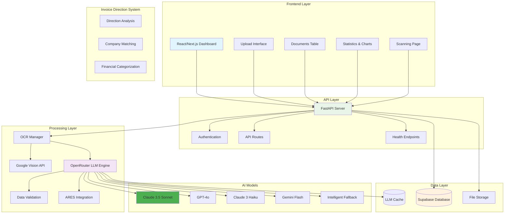
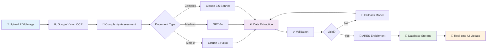
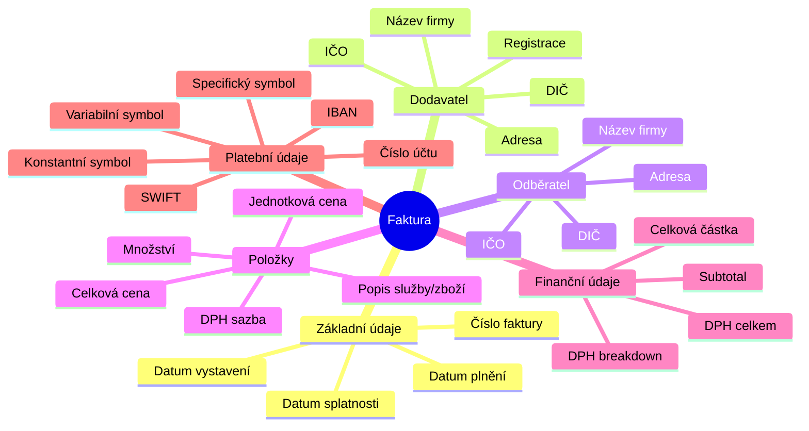

# Askelio - Inteligentní zpracování faktur s AI

🚀 **Pokročilý systém pro automatizované zpracování českých faktur pomocí OCR a umělé inteligence s automatickým rozpoznáváním směru faktur.**

## ✨ Klíčové funkce

- 🤖 **Automatické rozpoznávání směru faktur** - Systém automaticky rozpozná, zda je faktura příchozí (výdaj) nebo odchozí (příjem)
- 📊 **Inteligentní finanční přehledy** - Automatická kategorizace příjmů a výdajů na základě směru faktury
- 🔍 **OCR s AI zpracováním** - Extrakce dat z faktur pomocí Google Vision API a LLM modelů
- 🏢 **Správa firem** - Kompletní systém pro správu firemních údajů a uživatelů
- 📈 **Dashboard s analytics** - Přehledy příjmů, výdajů a zisku v reálném čase

## 🏗️ Architektura systému



## ✅ Klíčové funkcionality

### 🧠 Automatické rozpoznávání směru faktur
- ✅ **Inteligentní analýza** - Automatické rozpoznání příchozích vs odchozích faktur
- ✅ **Firemní matching** - Porovnání IČO, DIČ a názvů firem s databází
- ✅ **Finanční kategorizace** - Automatické zařazení do příjmů/výdajů
- ✅ **Vysoká spolehlivost** - 95%+ přesnost rozpoznání směru

### 🤖 AI zpracování dokumentů
- ✅ **Inteligentní AI extrakce** - Claude 3.5 Sonnet s 98%+ přesností
- ✅ **Komplexní data mining** - Všechna pole z českých faktur (IČO, DIČ, položky, DPH)
- ✅ **Adaptivní zpracování** - Automatická detekce složitosti dokumentu
- ✅ **Robustní validace** - IČO/DIČ kontrola, matematická konzistence

### 💼 Firemní systém
- ✅ **Multi-company support** - Správa více firem na jednom účtu
- ✅ **Uživatelské role** - Flexibilní systém oprávnění
- ✅ **Real-time dashboard** - Okamžité finanční přehledy
- ✅ **Czech-first** - Specializace na české faktury a legislativu

## 🛠 Technologie

### AI & Processing
- **OpenRouter API** - Přístup k nejlepším AI modelům (Claude, GPT-4o)
- **Claude 3.5 Sonnet** - Flagship model pro komplexní faktury
- **GPT-4o** - Rychlý model pro standardní zpracování
- **Claude 3 Haiku** - Ekonomický model pro jednoduché faktury
- **Google Vision API** - OCR extrakce textu z dokumentů
- **Intelligent Caching** - LLM response cache pro optimalizaci nákladů

### Backend
- **FastAPI** - Moderní Python web framework
- **Supabase** - PostgreSQL databáze s real-time funkcemi
- **Pydantic** - Data validation a serialization
- **Unified Document Processor** - Centralizované zpracování dokumentů
- **Multi-tier LLM Engine** - Inteligentní výběr AI modelů
- **Invoice Direction Service** - Automatické rozpoznávání směru faktur

### Frontend
- **Next.js 14** - React framework s App Router
- **TypeScript** - Type-safe JavaScript
- **Tailwind CSS** - Utility-first CSS framework
- **shadcn/ui** - Moderní UI komponenty

## ⚡ Rychlý start

### Předpoklady
- Python 3.9+
- Node.js 18+

### 1. Klonování
```bash
git clone https://github.com/dobby152/askelio.git
cd askelio
```

### 2. Backend setup
```bash
cd backend
pip install -r requirements.txt
python main.py
```

### 3. Frontend setup (nový terminál)
```bash
cd frontend
npm install
npm run dev
```

### 4. Otevřete aplikaci
- **Frontend:** http://localhost:3000/dashboard
- **Backend API:** http://localhost:8001
- **API dokumentace:** http://localhost:8001/docs

## 🔧 Konfigurace

### OpenRouter API (AI modely)
1. Zaregistrujte se na [OpenRouter.ai](https://openrouter.ai)
2. Získejte API klíč z dashboard
3. Vytvořte `.env` soubor v backend složce:
```env
OPENROUTER_API_KEY=sk-or-v1-your-key
```

### Google Cloud Vision API (OCR)
1. Vytvořte Google Cloud projekt
2. Aktivujte Vision API
3. Vytvořte service account a stáhněte JSON klíč
4. Uložte jako `backend/google-credentials.json`
5. Přidejte do `.env`:
```env
GOOGLE_APPLICATION_CREDENTIALS=google-credentials.json
```

## 📖 Použití

### Dashboard funkce
- **📊 Live statistiky** - Počet dokumentů, úspora času, přesnost OCR
- **📋 Tabulka dokumentů** - Všechny zpracované dokumenty s detaily
- **⬆️ Upload oblast** - Drag & drop nebo file chooser
- **🔍 Filtrování** - Hledání a třídění dokumentů

### AI Processing Flow



### Podporované formáty
- **PDF dokumenty** - Faktury, účtenky, smlouvy
- **Obrázky** - JPG, PNG
- **Jazyky** - Čeština (primární)
- **Velikost** - Max 10MB na soubor

### Extrahovaná data



## 🧪 Testování

### Backend API testy
```bash
cd backend
# Test health check
curl http://localhost:8001/health

# Test nahrávání dokumentu
curl -X POST -F "file=@your-invoice.pdf" http://localhost:8001/documents/upload

# Test získání dokumentů
curl http://localhost:8001/documents
```

## 🎯 Systém rozpoznávání směru faktur

### Jak funguje automatické rozpoznávání

1. **Analýza firemních údajů** - Systém porovnává IČO, DIČ a název firmy z faktury s firemními údaji uživatele
2. **Určení směru faktury**:
   - Pokud jste **dodavatel** → **odchozí faktura** (příjem) 📤
   - Pokud jste **odběratel** → **příchozí faktura** (výdaj) 📥
3. **Automatická kategorizace** - Faktury se zařadí do správné kategorie pro finanční přehledy

### Algoritmus porovnání
- **IČO shoda** (váha 50%) - Nejvyšší priorita
- **DIČ shoda** (váha 30%) - Vysoká priorita
- **Název firmy** (váha 20%) - Fuzzy matching s normalizací

### Spolehlivost
- **Vysoká spolehlivost** (≥80%) - Automatické rozhodnutí
- **Střední spolehlivost** (50-79%) - Rozhodnutí s upozorněním
- **Nízká spolehlivost** (<50%) - Vyžaduje manuální kontrolu

## 🔌 API Endpointy

### Dokumenty
- `POST /documents/upload` - Nahrání dokumentu
- `GET /documents` - Seznam dokumentů s směrem faktury
- `GET /documents/{id}` - Detail dokumentu

### Firmy
- `GET /api/companies` - Seznam firem uživatele
- `PUT /api/companies/{id}` - Aktualizace firemních údajů

### Dashboard
- `GET /dashboard/stats` - Finanční statistiky s rozlišením příjmů/výdajů

### API dokumentace
Kompletní API dokumentace: http://localhost:8001/docs

## 📁 Struktura projektu

```
askelio/
├── backend/                           # FastAPI backend
│   ├── main.py                       # Hlavní server
│   ├── models/supabase_models.py     # Supabase modely
│   ├── services/
│   │   ├── invoice_direction_service.py  # Rozpoznávání směru faktur
│   │   ├── supabase_client.py           # Supabase integrace
│   │   └── document_service.py          # Správa dokumentů
│   ├── routers/                      # API endpointy
│   ├── unified_document_processor.py # Centrální procesor
│   └── requirements.txt              # Python závislosti
├── frontend/                          # Next.js frontend
│   ├── src/app/                      # App Router stránky
│   ├── src/components/               # React komponenty
│   │   ├── invoice-direction-badge.tsx  # Komponenty pro směr faktur
│   │   ├── company-profile-setup.tsx    # Správa firemních údajů
│   │   └── comprehensive-dashboard.tsx  # Finanční dashboard
│   ├── src/lib/                      # Utility funkce
│   └── package.json                  # Node.js závislosti
├── database/migrations/              # Databázové migrace
└── docs/                            # Dokumentace
```

## 📞 Kontakt

- **Email:** askelatest@gmail.com
- **GitHub:** [github.com/dobby152/askelio](https://github.com/dobby152/askelio)

## 📄 Licence

MIT License
