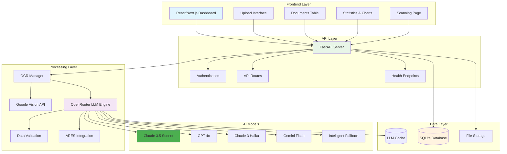

# Askelio - Inteligentní zpracování faktur s AI

🚀 **Pokročilý systém pro automatizované zpracování českých faktur pomocí OCR a umělé inteligence.**

## 🏗️ Architektura systému



## ✅ Klíčové funkcionality
- ✅ **Inteligentní AI extrakce** - Claude 3.5 Sonnet s 98%+ přesností
- ✅ **Komplexní data mining** - Všechna pole z českých faktur (IČO, DIČ, položky, DPH)
- ✅ **Adaptivní zpracování** - Automatická detekce složitosti dokumentu
- ✅ **Robustní validace** - IČO/DIČ kontrola, matematická konzistence
- ✅ **Moderní frontend** - React/Next.js s profesionálním designem
- ✅ **Real-time processing** - Okamžité zpracování a zobrazení výsledků
- ✅ **Intelligent fallback** - Vícenásobné AI modely pro maximální spolehlivost
- ✅ **Cost-optimized** - Inteligentní výběr modelů podle složitosti
- ✅ **Czech-first** - Specializace na české faktury a legislativu

## 🛠 Technologie

### AI & Processing
- **OpenRouter API** - Přístup k nejlepším AI modelům (Claude, GPT-4o)
- **Claude 3.5 Sonnet** - Flagship model pro komplexní faktury
- **GPT-4o** - Rychlý model pro standardní zpracování
- **Claude 3 Haiku** - Ekonomický model pro jednoduché faktury
- **Google Vision API** - OCR extrakce textu z dokumentů
- **Intelligent Caching** - LLM response cache pro optimalizaci nákladů

### Backend
- **FastAPI** - Moderní Python web framework
- **SQLite** - Lehká databáze pro development
- **Pydantic** - Data validation a serialization
- **Unified Document Processor** - Centralizované zpracování dokumentů
- **Multi-tier LLM Engine** - Inteligentní výběr AI modelů

### Frontend
- **Next.js 14** - React framework s App Router
- **TypeScript** - Type-safe JavaScript
- **Tailwind CSS** - Utility-first CSS framework
- **shadcn/ui** - Moderní UI komponenty

## ⚡ Rychlý start

### Předpoklady
- Python 3.9+
- Node.js 18+

### 1. Klonování
```bash
git clone https://github.com/dobby152/askelio.git
cd askelio
```

### 2. Backend setup
```bash
cd backend
pip install -r requirements.txt
python main.py
```

### 3. Frontend setup (nový terminál)
```bash
cd frontend
npm install
npm run dev
```

### 4. Otevřete aplikaci
- **Frontend:** http://localhost:3000/dashboard
- **Backend API:** http://localhost:8000
- **API dokumentace:** http://localhost:8000/docs

## 🔧 Konfigurace

### OpenRouter API (AI modely)
1. Zaregistrujte se na [OpenRouter.ai](https://openrouter.ai)
2. Získejte API klíč z dashboard
3. Vytvořte `.env` soubor v backend složce:
```env
OPENROUTER_API_KEY=sk-or-v1-your-key
```

### Google Cloud Vision API (OCR)
1. Vytvořte Google Cloud projekt
2. Aktivujte Vision API
3. Vytvořte service account a stáhněte JSON klíč
4. Uložte jako `backend/google-credentials.json`
5. Přidejte do `.env`:
```env
GOOGLE_APPLICATION_CREDENTIALS=google-credentials.json
```

## 📖 Použití

### Dashboard funkce
- **📊 Live statistiky** - Počet dokumentů, úspora času, přesnost OCR
- **📋 Tabulka dokumentů** - Všechny zpracované dokumenty s detaily
- **⬆️ Upload oblast** - Drag & drop nebo file chooser
- **🔍 Filtrování** - Hledání a třídění dokumentů

### AI Processing Flow

```mermaid
flowchart LR
    A[📄 Upload PDF/Image] --> B[🔍 Google Vision OCR]
    B --> C[🧠 Complexity Assessment]
    C --> D{Document Type}

    D -->|Simple| E[Claude 3 Haiku]
    D -->|Medium| F[GPT-4o]
    D -->|Complex| G[Claude 3.5 Sonnet]

    E --> H[📊 Data Extraction]
    F --> H
    G --> H

    H --> I[✅ Validation]
    I --> J{Valid?}

    J -->|No| K[🔄 Fallback Model]
    K --> H

    J -->|Yes| L[🏢 ARES Enrichment]
    L --> M[💾 Database Storage]
    M --> N[🔄 Real-time UI Update]

    style A fill:#e3f2fd
    style H fill:#f3e5f5
    style M fill:#e8f5e8
    style N fill:#fff3e0
```



### Podporované formáty
- **PDF dokumenty** - Faktury, účtenky, smlouvy
- **Obrázky** - JPG, PNG
- **Jazyky** - Čeština (primární)
- **Velikost** - Max 10MB na soubor

### Extrahovaná data

```mermaid
mindmap
  root((Faktura))
    Základní údaje
      Číslo faktury
      Datum vystavení
      Datum splatnosti
      Datum plnění
    Dodavatel
      Název firmy
      Adresa
      IČO
      DIČ
      Registrace
    Odběratel
      Název firmy
      Adresa
      IČO
      DIČ
    Položky
      Popis služby/zboží
      Množství
      Jednotková cena
      Celková cena
      DPH sazba
    Finanční údaje
      Subtotal
      DPH celkem
      Celková částka
      DPH breakdown
    Platební údaje
      Číslo účtu
      Variabilní symbol
      Konstantní symbol
      Specifický symbol
      IBAN
      SWIFT
```



## 🧪 Testování

### Backend API testy
```bash
cd backend
# Test health check
curl http://localhost:8000/health

# Test nahrávání dokumentu
curl -X POST -F "file=@your-invoice.pdf" http://localhost:8000/documents/upload

# Test získání dokumentů
curl http://localhost:8000/documents
```

## 🔌 API Endpointy

### Základní endpointy
- `GET /health` - Health check
- `POST /documents/upload` - Nahrání dokumentu
- `GET /documents` - Seznam dokumentů
- `GET /documents/{id}` - Detail dokumentu
- `GET /statistics` - Statistiky

### API dokumentace
Kompletní API dokumentace je dostupná na: http://localhost:8000/docs

## 📁 Struktura projektu

```
askelio/
├── backend/                    # FastAPI backend
│   ├── main.py                # Hlavní server
│   ├── models_sqlite.py       # Database models
│   ├── invoice_processor.py   # Invoice processing
│   ├── ocr_manager.py         # OCR management
│   ├── openrouter_llm_engine.py # LLM engine
│   └── requirements.txt       # Python závislosti
├── frontend/                   # Next.js frontend
│   ├── src/app/               # App Router stránky
│   ├── src/components/        # React komponenty
│   ├── src/lib/               # Utility funkce
│   ├── package.json           # Node.js závislosti
│   └── tailwind.config.ts     # Tailwind konfigurace
└── README.md                  # Dokumentace
```

## 📞 Kontakt

- **Email:** askelatest@gmail.com
- **GitHub:** [github.com/dobby152/askelio](https://github.com/dobby152/askelio)

## 📄 Licence

MIT License
