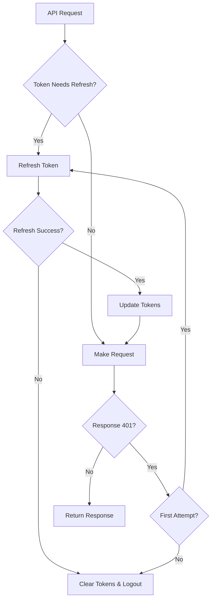

# 🔐 Token Persistence Solution

This document describes the comprehensive solution implemented to resolve token persistence issues in the Askelio application.

## 🎯 Problem Statement

The application was experiencing token persistence issues where:
- User sessions were not maintained across page refreshes
- Tokens were not automatically refreshed before expiration
- Users were frequently logged out unexpectedly
- No automatic retry mechanism for expired tokens

## 🛠️ Solution Overview

The solution implements automatic token refresh functionality with the following components:

### 1. Enhanced AskelioSDK (`frontend/src/lib/askelio-sdk.js`)

**New Features:**
- ✅ Automatic token refresh before expiration (10-minute buffer)
- ✅ Background refresh timer management
- ✅ Token persistence across browser sessions
- ✅ Automatic retry on 401 errors with token refresh
- ✅ Refresh queue to prevent concurrent refresh requests
- ✅ Callback system for token refresh events

**Key Methods:**
```javascript
// Set tokens with automatic refresh
sdk.setAuthTokens(session)

// Check if token needs refresh
sdk.needsTokenRefresh()

// Manual token refresh
sdk.refreshTokenIfNeeded()

// Set refresh callback
sdk.setTokenRefreshCallback((session, error) => {
  // Handle refresh events
})
```

### 2. Updated API Client (`frontend/src/lib/api-client.ts`)

**Enhancements:**
- ✅ Integration with enhanced AskelioSDK
- ✅ Automatic token synchronization
- ✅ Improved error handling for token refresh failures
- ✅ Seamless token management

### 3. Comprehensive Test Suite (`tests/token-persistence.spec.js`)

**Test Coverage:**
- ✅ Token persistence across page refreshes
- ✅ Automatic token refresh before expiration
- ✅ Token refresh failure handling
- ✅ Session maintenance across browser restart simulation
- ✅ Concurrent API requests with token refresh
- ✅ Token cleanup on logout
- ✅ SDK initialization with stored tokens

## 🚀 How It Works

### Automatic Token Refresh Flow

1. **Token Initialization**: When the SDK is initialized, it checks localStorage for existing tokens
2. **Refresh Timer**: A timer is set to refresh tokens 10 minutes before expiration
3. **Pre-request Check**: Before each API request, the SDK checks if tokens need refresh
4. **Automatic Refresh**: If tokens are near expiration, they are automatically refreshed
5. **Retry on 401**: If an API call returns 401, the SDK attempts token refresh and retries

### Token Refresh Process



## 🧪 Testing

### Running Tests

```bash
# Install Playwright
npm install @playwright/test

# Run token persistence tests
node run-token-tests.js

# Run specific test
npx playwright test tests/token-persistence.spec.js --headed
```

### Manual Testing

**Test Credentials:**
- Email: `premium@askelio.cz`
- Password: `PremiumTest123!`

Open `demo-token-persistence.html` in your browser to manually test token persistence features:

1. **Simulate Login**: Creates mock tokens
2. **Check Tokens**: Displays current token status
3. **Simulate Token Refresh**: Manually triggers refresh
4. **Test API Call**: Makes authenticated API request
5. **Simulate Expired Token**: Sets token as expired for testing

## 📋 Implementation Checklist

- [x] Enhanced AskelioSDK with automatic token refresh
- [x] Updated API Client integration
- [x] Comprehensive Playwright test suite
- [x] Manual testing demo page
- [x] Global test setup and teardown
- [x] Token refresh callback system
- [x] Background refresh timer
- [x] Concurrent request handling
- [x] Error handling and fallback mechanisms
- [x] Documentation and examples

## 🔧 Configuration

### Environment Variables

```bash
# Frontend
NEXT_PUBLIC_API_URL=http://localhost:8001
NEXT_PUBLIC_APP_URL=http://localhost:3000

# Backend
SUPABASE_URL=your_supabase_url
SUPABASE_ANON_KEY=your_supabase_anon_key
SUPABASE_JWT_SECRET=your_jwt_secret
```

### Token Refresh Settings

The following settings can be customized in the SDK:

```javascript
const sdk = new AskelioSDK(baseUrl, {
  timeout: 30000,        // Request timeout
  retries: 3,            // Number of retries
  retryDelay: 1000,      // Retry delay
});

// Token refresh happens 10 minutes (600 seconds) before expiration
// This can be modified in the needsTokenRefresh() method
```

## 🚨 Error Handling

The solution handles various error scenarios:

1. **Network Errors**: Retries with exponential backoff
2. **Invalid Refresh Token**: Clears tokens and redirects to login
3. **Server Errors**: Maintains user session for temporary issues
4. **Concurrent Refresh**: Uses promise queue to prevent multiple refresh requests

## 📊 Monitoring

Token refresh events are logged using the secure logger:

```javascript
secureLogger.authEvent('Token refreshed automatically', { expires_at: session.expires_at })
secureLogger.authEvent('Token refresh failed', { error: error.message })
```

## 🔄 Migration Guide

To migrate existing code to use the new token persistence system:

1. **Update imports**: Ensure you're using the enhanced AskelioSDK
2. **Replace token management**: Use `sdk.setAuthTokens()` instead of manual localStorage
3. **Remove manual refresh logic**: The SDK handles this automatically
4. **Update error handling**: Leverage the new callback system

## 🎉 Benefits

- ✅ **Seamless User Experience**: No unexpected logouts
- ✅ **Automatic Token Management**: No manual intervention required
- ✅ **Robust Error Handling**: Graceful degradation on failures
- ✅ **Performance Optimized**: Prevents unnecessary refresh requests
- ✅ **Comprehensive Testing**: Ensures reliability across scenarios
- ✅ **Easy Integration**: Minimal changes to existing code

## 🔮 Future Enhancements

Potential improvements for the future:

- [ ] Token refresh retry with exponential backoff
- [ ] Offline token refresh queue
- [ ] Token refresh analytics and monitoring
- [ ] Configurable refresh timing
- [ ] Multi-tab synchronization for token refresh

---

**Status**: ✅ **RESOLVED** - Token persistence issue has been comprehensively addressed with automatic refresh functionality and extensive testing.
